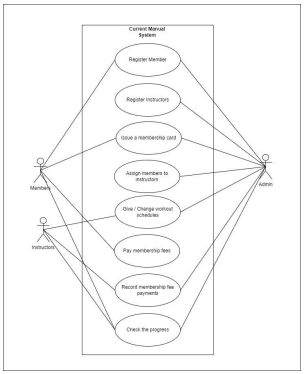

# GYM-System
• Visitors can register to the system as a member, online using the system.

• Member can log in to the system and assign a trainer according to the Member's preference and 
the Trainer's availability.

• Admin can add, update, or delete any user.

• Members can book their Trainer if the Trainer is available within that day.

• The Trainer can log in to the system and set the availability during that day.

• Admin can set opening and closing times of the fitness academy. Trainers and members can see 
that information.

The web-based system for Friends and Fitness Sports Club will have many features to achieve its 
functionality. It mainly focuses on the registration process of customers and connects the 
customers with their instructors.

• Payments

• Attendance

• Reports

• Exercise schedule management

Are some extra features hope to add to the system

